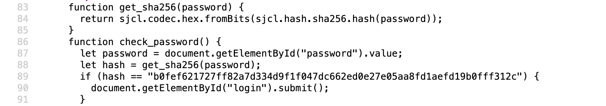
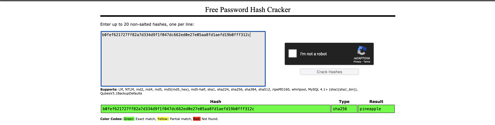

For this challenge, we're given a link to a website. It looks to be a secure
login page. 

We can inspect the submit button for the login section and see the
function used to check the password. Additionally, we see what the password is
hashed with through another function. The hash turns out to be  b0fef621727ff82a7d334d9f1f047dc662ed0e27e05aa8fd1aefd19b0fff312c

The inputted password is compared with
the hashed password. For more evidence that SHA-256 was used, The website tells us that the password was hashed using
SHA-256, so with this information we can crack the password.

After this, we can inspect element to copy the flag from the next page.

And we get our flag, osu{p1n34ppl3_h45h_Br0wN5_4r3_g00D}!

