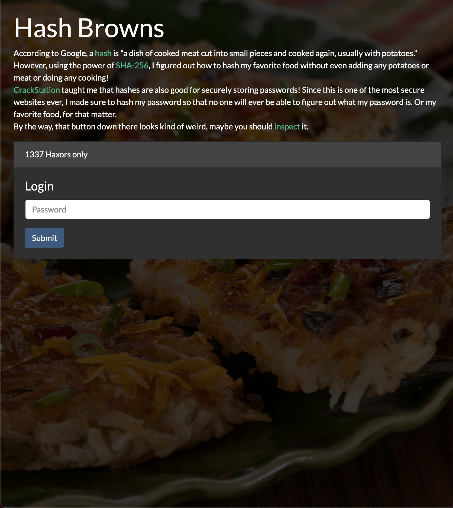

For this challenge, we're given a link to a website. It looks to be a secure
login page. 

We can inspect the submit button for the login section and see the
function used to check the password. The inputted password is compared with
the hashed password. The website tells us that the password was hashed using
SHA-256, so with this information we can crack the password.

After this, we can inspect element to copy the flag from the next page.
